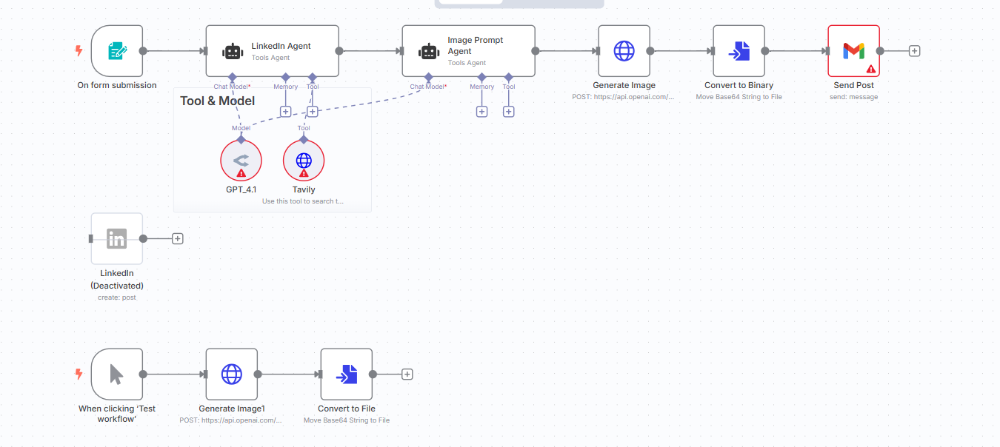

# 🚀 AI-Powered LinkedIn Post & Image Generator

This automation workflow generates professional LinkedIn posts *and* creates a matching AI-generated image — all in under 60 seconds — using no-code tools and powerful AI services.

## 📌 Overview

This project is built with **n8n**, an open-source workflow automation tool, and integrates multiple AI APIs to create an end-to-end content generation system.

### 💡 What It Does

- Takes input from a simple form: Topic, Target Audience, and Email
- Searches the web for real-time information using **Tavily**
- Uses **GPT-4.1 (via OpenRouter)** to generate a professional, audience-specific LinkedIn post
- Transforms the post into a visual prompt using another AI agent
- Generates a matching image using **OpenAI’s DALL·E**
- Delivers the complete content bundle (post + image) via Gmail
- (Optional: Direct posting to LinkedIn — disabled by default)

---

## 🛠️ Tech Stack

- **n8n** – Workflow orchestration
- **OpenRouter (GPT-4.1)** – Post generation
- **Tavily API** – Real-time search data
- **OpenAI (DALL·E)** – Image generation
- **Gmail API** – Email delivery
- **LinkedIn API** *(optional)* – Post publishing

---

## 🧩 Workflow Breakdown

1. **Form Trigger**  
   Captures Topic, Target Audience, and Email

2. **Tavily Search**  
   Performs real-time search based on the topic

3. **GPT-4.1 via OpenRouter**  
   Creates a structured, professional LinkedIn post

4. **Prompt Generator Agent**  
   Analyzes the post and creates a prompt for visual generation

5. **OpenAI Image Generation**  
   Generates a branded image (1024x1024)

6. **Convert Image to Binary**  
   Prepares the image file for email delivery

7. **Send Post via Gmail**  
   Sends the post and image bundle to the user’s email

---

## 📷 Screenshot

  
> *Visual flow in n8n showing full automation from form to delivery.*

---

## 🚀 Setup Instructions

1. **Clone this workflow in n8n**
2. Create credentials for:
   - **OpenRouter API**
   - **Tavily API**
   - **OpenAI API (image endpoint)**
   - **Gmail or LinkedIn OAuth2** (depending on delivery method)
3. Update placeholder keys in the HTTP Request nodes
4. Deploy and test using the manual trigger or live form

---

## 📬 Output Example

- ✍️ LinkedIn post written in your tone
- 🎨 Matching graphic image for visual engagement
- 📩 Delivered as a content bundle to your inbox

---

## 📈 Why It Matters

This workflow allows content creators, marketers, and founders to scale their personal brand without spending hours on writing and design. It turns a simple input into a full content asset using smart automation.

---

## 🙌 Built By

**Hassan Rauf**  
Blockchain & Automation Developer  
[LinkedIn Profile](https://www.linkedin.com/in/hassan-rauf09) • [GitHub](https://github.com/hassanrauf1) 

---

## 📄 License

This project is open-source and free to use under the MIT License.
